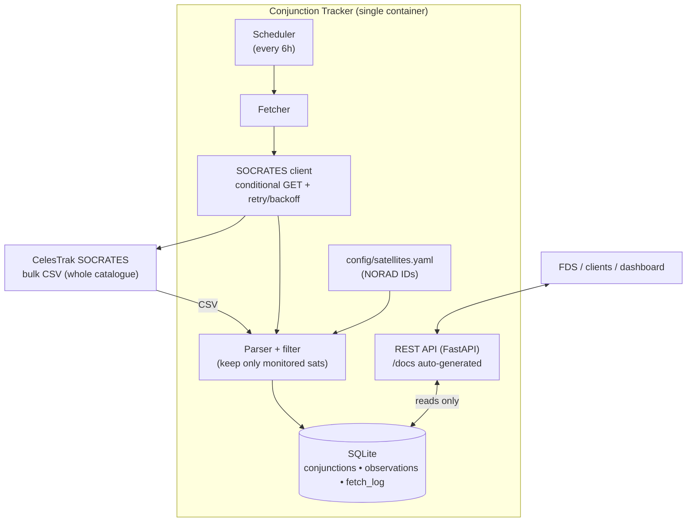
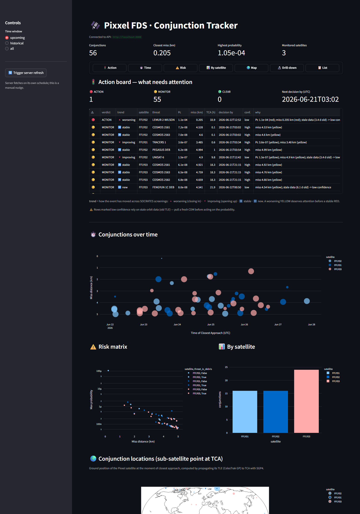

# Pixxel FDS — Conjunction Tracker

A Flight Dynamics conjunction-awareness service. It fetches close-approach
("conjunction") predictions from **CelesTrak SOCRATES** for a configured set of
satellites, stores **current and historical** data, and serves it through a
documented **REST API**. The entire service runs in a **Docker** container. A
**Streamlit dashboard** (bonus) visualises conjunctions by time, severity, and
ground location.

Built for the Pixxel Flight Dynamics intern assignment.

---

## Contents
- [What it does](#what-it-does)
- [Architecture](#architecture)
- [Quick start (Docker)](#quick-start-docker)
- [Quick start (local, no Docker)](#quick-start-local-no-docker)
- [Configuration](#configuration)
- [Adding a new satellite](#adding-a-new-satellite)
- [REST API](#rest-api)
- [Staying un-banned by CelesTrak](#staying-un-banned-by-celestrak)
- [Historical data model](#historical-data-model)
- [Dashboard (bonus)](#dashboard-bonus)
- [Testing](#testing)
- [Project layout](#project-layout)
- [Design documentation](#design-documentation)

---

## What it does

The Pixxel Firefly satellites we monitor:

| NORAD ID | Name   | Notes                         |
|----------|--------|-------------------------------|
| 65320    | FFLY01 | Pixxel Firefly-1 (hyperspectral) |
| 65322    | FFLY02 | Pixxel Firefly-2 (hyperspectral) |
| 65319    | FFLY03 | Pixxel Firefly-3 (hyperspectral) |

For each, the service answers: **what is going to come close to it, when, how
close, how fast, and how likely is a collision** — plus a full history of how
each prediction evolved over successive screenings.

On top of the raw geometry it adds the flight-dynamics judgement layer:

- **Risk triage** — every conjunction is classified RED / YELLOW / GREEN from Pc
  and miss distance, with a maneuver-decision deadline (TCA − planning lead).
- **Trend** — each event reports whether it is `worsening` / `improving` /
  `stable` / `new` across screenings (geometry-first). *A worsening YELLOW often
  matters more than a stable RED.*
- **Confidence** — events computed from stale TLEs are flagged low-confidence.
- **Data-freshness alarm** — `/health` goes `degraded` if the last successful
  SOCRATES contact is older than the freshness limit, so stale awareness can't
  masquerade as current awareness.

> **Caveat on Pc:** SOCRATES `max_probability` is derived from public TLEs with an
> assumed hard-body radius, not precise operational ephemeris. Treat RED as
> *"pull a real CDM / operator ephemeris before maneuvering,"* not a final
> maneuver trigger.

---

## Architecture

Two responsibilities are deliberately **decoupled**: a scheduled *fetcher* that
ingests data, and a *REST API* that only ever reads from our own database. The
API never calls CelesTrak, so it can be queried freely without any risk of an
IP ban.



See [`docs/DESIGN.md`](docs/DESIGN.md) for the decision rationale and more
flowcharts.

---

## Quick start (Docker)

> Requires Docker + Docker Compose.

```bash
docker compose up --build     # runs out of the box; no .env required
```

> The service ships with sensible defaults, so it runs with no configuration.
> To override any setting, copy `cp .env.example .env` first and edit it — the
> compose file picks it up automatically if present.

Then open:

| Service           | URL                              |
|-------------------|----------------------------------|
| API root          | http://localhost:8000            |
| **Swagger docs**  | http://localhost:8000/docs       |
| ReDoc             | http://localhost:8000/redoc      |
| Health            | http://localhost:8000/health     |
| **Dashboard**     | http://localhost:8501            |

On startup the service performs one fetch, then refreshes every 6 hours.
Historical data is persisted in the `conjunction-data` Docker volume.

To run **only the API** (no dashboard):

```bash
docker compose up --build api
```

---

## Quick start (local, no Docker)

> Requires Python 3.11+.

```bash
python -m venv .venv
source .venv/Scripts/activate      # Windows (Git Bash);  use .venv/bin/activate on Linux/macOS
pip install -r requirements.txt

cp .env.example .env
python -m app.main
```

API on http://localhost:8000 (docs at `/docs`).

Run the dashboard separately:

```bash
pip install -r dashboard/requirements.txt
API_BASE_URL=http://localhost:8000 streamlit run dashboard/dashboard.py
```

---

## Configuration

Two layers, by design:

1. **Mission config** — *which satellites to monitor* — lives in
   [`config/satellites.yaml`](config/satellites.yaml). Human-editable.
2. **Operational settings** — URLs, intervals, paths — come from **environment
   variables** (see [`.env.example`](.env.example)). Nothing sensitive is
   hardcoded.

| Variable | Default | Purpose |
|----------|---------|---------|
| `SOCRATES_SOURCE_URL` | `…/SOCRATES/sort-minRange.csv` | Bulk conjunction CSV |
| `FETCH_INTERVAL_HOURS` | `6` | Scheduled fetch cadence |
| `MIN_FETCH_INTERVAL_MINUTES` | `60` | Floor between any two fetches (anti-abuse) |
| `HTTP_USER_AGENT` | `Pixxel-FDS-…` | Identifies us to CelesTrak |
| `HTTP_TIMEOUT_SECONDS` | `60` | Per-request timeout |
| `HTTP_MAX_RETRIES` | `4` | Retry budget on 429/5xx/transport errors |
| `HTTP_BACKOFF_BASE_SECONDS` | `5` | Exponential backoff base |
| `FETCH_ON_STARTUP` | `true` | Fetch once at boot |
| `DATABASE_PATH` | `./data/conjunctions.db` | SQLite file |
| `SATELLITE_CONFIG_PATH` | `./config/satellites.yaml` | Mission config |
| `API_HOST` / `API_PORT` | `0.0.0.0` / `8000` | Server bind |
| `LOG_LEVEL` | `INFO` | Logging verbosity |

---

## Adding a new satellite

This is a **one-line, no-code change** — exactly what you want when a new
Firefly launches:

```yaml
# config/satellites.yaml
satellites:
  - norad_id: 65320
    name: FFLY01
  - norad_id: 65322
    name: FFLY02
  - norad_id: 65319
    name: FFLY03
  - norad_id: 70000        # <-- new launch
    name: FFLY04
```

Restart the service (or just wait for the next cycle if mounted read-write).
Because we already download the **whole-catalogue** CSV, the new satellite adds
**zero** extra requests to CelesTrak.

---

## REST API

Full interactive documentation is auto-generated at **`/docs`**. Summary:

| Method | Path | Description |
|--------|------|-------------|
| GET | `/health` | Service status, last fetch, DB counts |
| GET | `/satellites` | Configured satellites + conjunction counts |
| GET | `/satellites/{norad_id}/conjunctions` | Conjunctions for one satellite |
| GET | `/conjunctions` | Query conjunctions (filters below) |
| GET | `/conjunctions/{id}` | One conjunction + full screening history |
| GET | `/alerts` | Actionable RED/YELLOW triage, most urgent first |
| GET | `/threats` | Threats grouped by object — fleet-level picture |
| POST | `/refresh` | Trigger a fetch now (subject to min-interval guard) |

**Common query parameters** on the list endpoints:

- `time_filter` = `upcoming` (default) \| `historical` \| `all`
- `norad_id` — restrict to one monitored satellite
- `max_miss_km` — only approaches closer than this
- `min_probability` — only events riskier than this
- `order_by` = `tca` (default) \| `miss` \| `probability`
- `limit` (≤1000), `offset` — pagination

**Examples:**

```bash
# Upcoming conjunctions, soonest first
curl "http://localhost:8000/conjunctions"

# The 10 closest approaches across the fleet (any time)
curl "http://localhost:8000/conjunctions?time_filter=all&order_by=miss&limit=10"

# Everything threatening FFLY02 within 2 km
curl "http://localhost:8000/conjunctions?norad_id=65322&max_miss_km=2"

# Drill into one event and see how the prediction evolved
curl "http://localhost:8000/conjunctions/<id>"

# Fleet-level: which objects threaten 2+ of the Fireflies in one pass?
curl "http://localhost:8000/threats?min_satellites=2"
```

### 60-second demo

With the API running (`docker compose up` or local), this walks the whole
operational story — fetch → triage → fleet view → drill-down:

```bash
# 1. Is the service healthy and is the data fresh?
curl -s localhost:8000/health | jq '{status, data_fresh, db: .database}'

# 2. What must Flight Dynamics act on right now? (RED/YELLOW, most urgent first)
curl -s "localhost:8000/alerts" | jq '{red_count, yellow_count, next_decision_by_utc}'

# 3. Which objects threaten the whole constellation (2+ Fireflies)?
curl -s "localhost:8000/threats?min_satellites=2" \
  | jq '.threats[] | {threat: .threat.name, sats: .satellites_threatened, worst: .worst_risk_level}'

# 4. Take the worst event and see how its prediction evolved across screenings.
ID=$(curl -s "localhost:8000/conjunctions?order_by=miss&time_filter=all&limit=1" | jq -r '.results[0].id')
curl -s "localhost:8000/conjunctions/$ID" | jq '{satellite: .satellite.name, threat: .threat.name, risk: .risk.level, trend: .trend.direction, screenings: (.observations | length)}'
```

Sample conjunction object:

```json
{
  "id": "a1b2c3d4e5f6a7b8",
  "tca_utc": "2026-06-24T23:42:14.024000+00:00",
  "is_historical": false,
  "hours_to_tca": 119.6,
  "miss_distance_km": 0.854,
  "relative_speed_km_s": 12.907,
  "max_probability": 3.599e-06,
  "dilution_km": 0.339,
  "satellite": {"norad_id": 65319, "name": "FFLY03", "status": "operational",
                "is_monitored": true, "is_debris": false},
  "threat":    {"norad_id": 22286, "name": "COSMOS 2228", "status": "unknown",
                "is_monitored": false, "is_debris": false},
  "both_monitored": false,
  "screening_count": 3,
  "first_seen_utc": "2026-06-19T22:13:00+00:00",
  "last_updated_utc": "2026-06-20T10:01:00+00:00"
}
```

---

## Staying un-banned by CelesTrak

CelesTrak is free and blocks IPs that query it too often. Our strategy:

1. **One bulk download per cycle.** We fetch `sort-minRange.csv` (the whole
   catalogue) once and filter locally — *not* one request per satellite. Adding
   satellites never adds requests.
2. **The API never touches CelesTrak.** It reads only our SQLite DB, so client
   traffic — however heavy — generates zero upstream load.
3. **Conservative cadence.** SOCRATES recomputes ~3×/day; we fetch every 6 h.
4. **Conditional GET.** We send `If-None-Match` / `If-Modified-Since`; unchanged
   data returns `304 Not Modified` with no body.
5. **Min-interval guard.** A hard floor (default 60 min) between any two fetches
   stops manual `/refresh` calls from hammering the source.
6. **Identifying User-Agent**, **timeouts**, and **bounded retries with
   exponential backoff + jitter** (honouring `Retry-After`).

---

## Historical data model

"Keeping track of older conjunctions" is a first-class feature:

- A conjunction is identified by a stable key — the normalised object pair plus
  TCA-to-the-minute — so the same physical event is recognised across
  re-screenings instead of being duplicated.
- Rows are **upserted, never deleted**, so once TCA passes, the event simply
  becomes *historical* (served via `time_filter=historical`).
- Every screening also appends to a `conjunction_observations` log, letting the
  API show **how a prediction evolved** (miss distance / probability trend) —
  the signal an analyst watches when deciding on a collision-avoidance maneuver.

---

## Dashboard (bonus)

A Streamlit app (`dashboard/`) that queries the API and shows:

- **🚦 Action board** — verdict-first triage: RED/YELLOW counts, the next
  decision deadline, and every actionable event with its **trend** (worsening /
  improving) so you read the situation, not a chart.
- **Conjunctions over time** — TCA vs miss distance (the “time in a plot” view).
- **Risk matrix** — miss distance vs collision probability.
- **Per-satellite** breakdown.
- **🌍 Location map** — the **sub-satellite ground point at TCA**, computed by
  propagating each satellite's TLE (CelesTrak GP) to the TCA with SGP4
  (skyfield). Degrades gracefully if TLEs can't be fetched.
- **Prediction-evolution** drill-down per conjunction.

A sticky section navbar jumps between all of the above.



> _To regenerate the screenshot: run the stack, open <http://localhost:8501>,
> and save a full-page capture to `docs/dashboard.png`._

**📖 [Dashboard Guide](docs/DASHBOARD_GUIDE.md)** — a plain-English walkthrough of
every section (what each number means, how to read each chart), written for a
quick verbal explanation.

> **Note on "upcoming" dates vs storing history.** The dashboard defaults to the
> **upcoming** time window (future TCAs) because that is the operational view, so
> you will see future dates first. Past conjunctions **are** stored and served —
> switch the sidebar **Time window** to `historical` / `all`, or call the API with
> `?time_filter=historical`. The Conjunction list is sorted by **closest miss
> first** (not by time), because the most dangerous approach matters more than the
> next one.

---

## Testing

```bash
pip install -r requirements.txt httpx pytest
pytest
```

53 tests (no network) cover the parser/filter, the dedup + observation-history
DB logic, the risk classifier and trend analysis, the polite SOCRATES client's
anti-ban behaviour (conditional GET, retry/backoff, Retry-After, give-up), and
the API — including the fleet-level `/threats` grouping — against a real
SOCRATES sample fixture.

---

## Project layout

```
conjunction-tracker/
├── app/
│   ├── config.py           # env settings + YAML satellite loader
│   ├── socrates_client.py  # polite HTTP client (conditional GET, retries)
│   ├── parser.py           # CSV parse + filter + pair normalisation
│   ├── database.py         # SQLite: upsert, observations, fetch log, queries
│   ├── fetcher.py          # one fetch cycle (orchestration, error handling)
│   ├── scheduler.py        # APScheduler periodic trigger
│   ├── schemas.py          # API response models (drive OpenAPI docs)
│   ├── api.py              # FastAPI app + routes + lifespan wiring
│   └── main.py             # entrypoint
├── config/satellites.yaml  # the satellites we monitor (edit me)
├── dashboard/              # bonus Streamlit visualisation
├── tests/                  # pytest suite + sample SOCRATES fixture
├── docs/DESIGN.md          # design decisions + flowcharts
├── docs/DASHBOARD_GUIDE.md # plain-English guide to every dashboard section
├── Dockerfile
├── docker-compose.yml
├── requirements.txt
└── .env.example
```

---

## Design documentation

See [`docs/DESIGN.md`](docs/DESIGN.md) for the rationale behind every major
decision (bulk CSV vs per-satellite scraping, SQLite, the two-table history
model, the anti-ban layering, single-container deployment) and additional
sequence/flow diagrams.

---

## Data source & attribution

Conjunction data: **CelesTrak SOCRATES** (Dr. T.S. Kelso), https://celestrak.org.
A free service — please use it responsibly, as this project is designed to.
