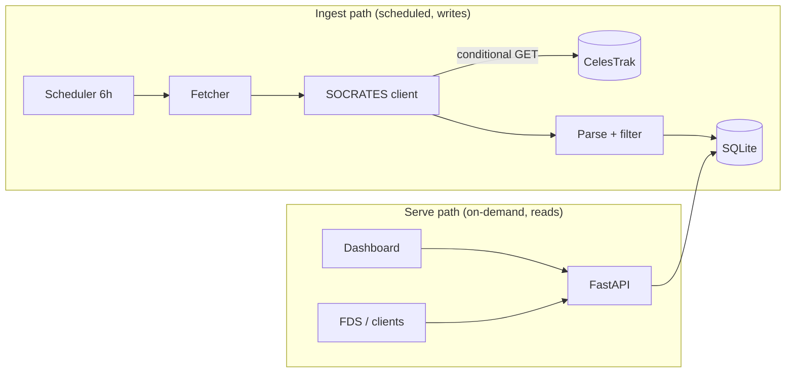
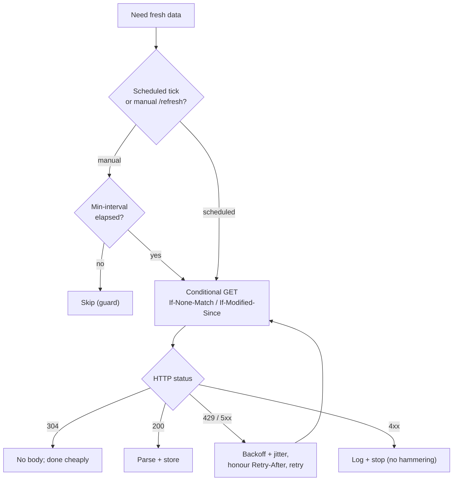
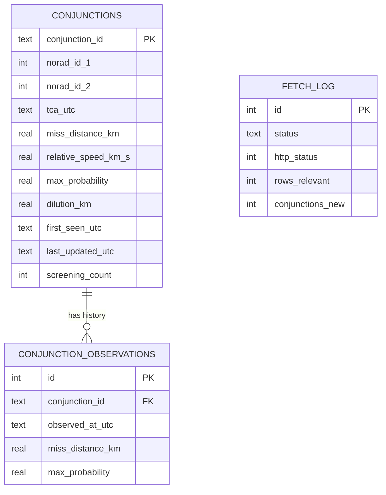
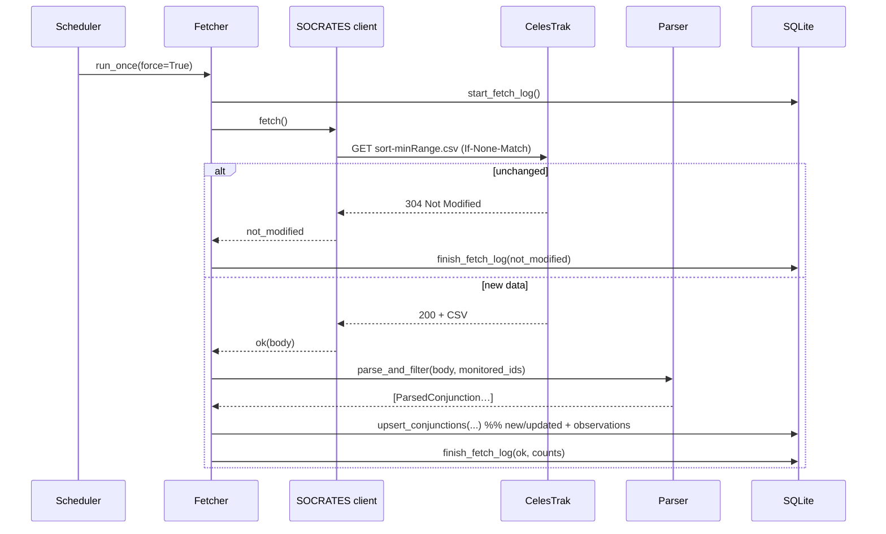

# Design Documentation — Conjunction Tracker

This document explains **what was built and why**. It is written to be read
alongside the code, and to justify the engineering trade-offs an FDS reviewer
would care about.

---

## 1. Problem framing

Pixxel Flight Dynamics must keep its satellites safe from collisions. That
requires continuous awareness of predicted close approaches ("conjunctions")
between our satellites and everything else on orbit (active satellites, dead
satellites, debris, rocket bodies).

CelesTrak **SOCRATES** publishes such predictions for the whole catalogue,
recomputed ~3×/day over a rolling 7-day window with a 5 km screening threshold.

**Goal:** a service that ingests SOCRATES data for our satellites, retains
current + historical conjunctions, and serves them over a documented REST API —
all in a container, without getting our IP banned by CelesTrak.

Our monitored fleet: **FFLY01 (65320), FFLY02 (65322), FFLY03 (65319)**.

---

## 2. Key decision: bulk CSV, not per-satellite scraping

SOCRATES exposes two access paths:

| Option | Mechanism | Verdict |
|--------|-----------|---------|
| `table-socrates.php?CATNR=<id>` | Returns an **HTML page** per satellite | ❌ Fragile to parse; N requests for N satellites |
| `SOCRATES/sort-minRange.csv` | One **RFC-4180 CSV** of the entire catalogue (~16 MB, ~148k rows) | ✅ Clean, machine-readable, **single request** |

We chose the **bulk CSV** and filter locally to our configured NORAD IDs.

Why this matters:

- **Anti-ban:** one request per cycle regardless of how many satellites we
  watch. Onboarding a new satellite adds **zero** network load.
- **Robustness:** parsing a documented CSV schema beats scraping HTML tables.
- **Completeness:** a conjunction lists two objects; our satellite can be either
  one. The bulk file lets us catch our satellites in **both** columns reliably.

Verified empirically before coding: the three satellites appear in the live feed
(78 conjunctions across the fleet at time of writing), and our satellite shows
up as object 1 *and* object 2 — confirming the both-columns filter is required.

---

## 3. Architecture: decoupled ingest and serving



**Rationale:** the serving path must be cheap, always-available, and unable to
trigger upstream traffic. By making the API read-only against our own DB, no
amount of client traffic can get us rate-limited. The ingest path is the *only*
thing that talks to CelesTrak, and it is strictly throttled.

Both paths run **in one process / one container** (FastAPI lifespan starts the
APScheduler background job), satisfying the single-container requirement while
keeping the logical separation clean.

---

## 4. Anti-ban strategy (layered)



Defence in depth, so no single failure causes abusive traffic:

1. **Bulk download** → minimum request count.
2. **Read-only API** → client load never reaches CelesTrak.
3. **6-hour cadence** → matched to the source's ~3×/day recompute.
4. **Conditional GET** → `304` when unchanged (near-zero cost).
5. **Min-interval guard** → manual refreshes can't hammer the source.
6. **Identifying User-Agent**, **timeouts**, **bounded retries** with
   **exponential backoff + jitter**, honouring `Retry-After`.

---

## 5. Data model



**Identity / dedup.** A conjunction's key is the **normalised object pair**
(lower NORAD ID first, so column order is irrelevant) **+ TCA rounded to the
minute**. The same physical event drifts only sub-minute between re-screenings,
so it maps to one row; genuinely distinct events differ by far more than a
minute. Rows are **upserted, never deleted**.

> **Known limitation (identity).** Minute-rounding handles the common case, but
> for events several days out SOCRATES' TCA estimate can move by more than a
> minute between screenings; if it crosses a minute boundary the event is seen
> as *new*, which over-counts new events and resets that event's trend. A more
> robust scheme keys on the pair plus a **TCA tolerance window** (e.g. cluster
> screenings whose TCA is within ±15 min of an existing open event). Deferred
> because it adds windowing complexity for a modest accuracy gain at this scale.

**Upcoming vs historical** is *derived* (`tca_utc` vs now), not a stored flag —
so it is always correct without a background job flipping statuses. Past events
remain in the DB as the historical archive even after SOCRATES drops them from
its 7-day window.

**Observation log.** Every screening appends a row capturing the prediction *at
that time*. This makes the prediction's **evolution** queryable — the trend
(is the miss distance shrinking? probability rising?) that drives a real
go/no-go maneuver decision. This is the genuinely "Flight Dynamics" feature of
the design.

**Why SQLite?** Zero-ops, single portable file on a mounted volume,
transactional, fast for this read-mostly, modest-volume workload. All SQL is
isolated in `database.py` (repository pattern), so migrating to PostgreSQL later
is a localised change. WAL mode is enabled for concurrent reads (API) alongside
the single writer (scheduler).

---

## 6. Ingest sequence



Every cycle is wrapped so a failure is logged to `fetch_log` and surfaced via
`/health`, but **never crashes** the API process.

---

## 7. Configuration philosophy

- **Mission config** (`config/satellites.yaml`) — *what we monitor* — is data,
  not code. Adding a satellite is a one-line edit; no redeploy of logic. This is
  the explicit "support future satellites" requirement.
- **Operational config** (env vars) — *how we run* — covers URLs, intervals,
  paths, and any credentials. Nothing sensitive is hardcoded; `.env.example`
  documents every knob. (SOCRATES needs no API key, but the pattern is in place
  for sources that do.)

---

## 8. Bonus: location visualization

SOCRATES provides **when** (TCA) and the encounter geometry, but **not** a
ground coordinate. To plot *location*, the dashboard propagates the monitored
satellite's **TLE** (fetched from CelesTrak's GP API and cached) to the TCA
using **SGP4** (via `skyfield`), then takes the **sub-satellite point**
(lat/lon) — i.e. where over the Earth the close approach happens. If TLEs are
unavailable, the map degrades gracefully and the time/severity views are
unaffected.

---

## 9. What I would add next (production hardening)

- **Alerting**: push notifications when miss distance < threshold or probability
  > threshold (the natural next step toward an operational CA workflow).
- **Auth** on the API (API keys / mTLS) for non-public deployment.
- **Retention/rollup** policy for very old observations.
- **Postgres + Alembic** migrations if multi-instance or higher volume is needed.
- **Covariance-aware Pc** if higher-fidelity ephemerides/covariances become
  available (SOCRATES `MAX_PROB` is deliberately conservative).
- **RIC miss components.** Operationally, *radial* separation matters more than
  total miss distance, but SOCRATES publishes only the scalar `TCA_RANGE` (no
  covariance / no radial–in-track–cross-track split), so it cannot be derived
  from this feed alone — it needs a CDM or operator ephemeris.
- **Stable event identity** via a TCA tolerance window (see §5 known limitation).
```
